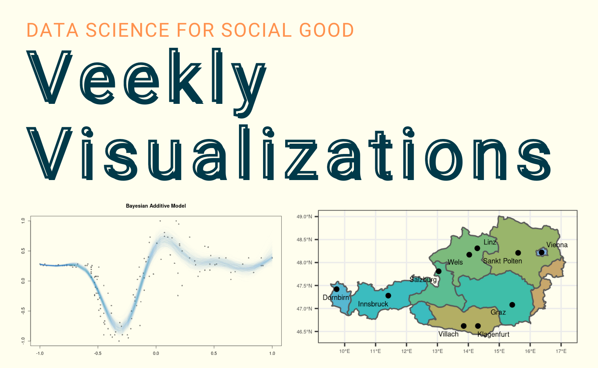

# Weekly Visualisations - mostly harmless -

For each session of our (Local Chapter Austria)  workshop series you can find all the information here. Just scroll down to the corresponding workshop and click on the title to find out more about the event!

Please register if you want to take part: [Link to workshop registration](https://forms.gle/YqB4mbbze7CawFdL6)

*we will send you details for participating in workshop (google meet link, link to materials) one day before the workshop - registration is mandatory*

## 2023
| Date & Time | Topic | Description | Prerequisites | Venue | Lecturer |
| -- | -- | -- | -- | -- | -- |
| 2023-04-25 20:00 CET | [Introduction into data visualisation with R & ggplot](materials/2023-04-25_ggplot2_basics/readme.md) | Short introduction into data visualisation in R with ggplot. We will explore the main functions and create first plots. | We will provide the code before, so you can just change the variables without detailed R knowledge | online | [Felix](https://polsci.social/@fewohlgemuth) |
| 2023-05-09 20:00 CET | [Learn how to visualise basic spatial data in R using ggplot](materials/2023-05-09_ggplot2_spatial/readme.md) | The goal of this week is to get to know the sf-package in R and to get an idea of how to create simple spatial plots with it. | none, basic R knowledge helps | online | Julian |
| 2023-05-16 20:00 CET | [Introduction to Global Fishing Watch Data & R Package](materials/2023-05-16_intro_GFW/readme.md) | Tyler Clavelle (author of Global Fishing Watch R package) will present the work of Global Fishing Watch (GFW) in bringing transparency to global fisheries and their efforts in making data publicly available and usable. The goal is to get familiar with the GFW database, its content and structure.| none, basic R knowledge helps  | online | Tyler Clavelle |
| 2023-05-23 20:00 CET | [Visualization of Global Fishing Watch Data I](materials/2023-05-23_GFW_visualisation_development/readme.md) | Explore the data from Global Fishing Watch which we were able to access via their R package. The goal is to develop ideas of use-cases and visualizations of their data. | none, basic R knowledge helps  | online & Vienna | Arne |
| 2023-05-30 20:00 CET | [Visualization of Global Fishing Watch Data II](materials/2023-05-30_GFW_visualisation_presentation/readme.md) | Finalize and discuss our visualizations of Global Fishing Watch's data. | none, basic R knowledge helps | online & Vienna | Arne |
| 2023-06-13 20:00 CET | [Basic Quarto](materials/2023-06-13_Quarto_basics/readme.md) | Idea of Quarto; Comparison to Rmarkdown; Getting started in Quarto Use Cases; most important features, yaml | none, basic R knowledge or LaTex helps | online | Simon & Julian |
| 2023-06-20 20:00 CET | [Quarto - tba](materials/2023-06-20_Quarto_2/readme.md) |  |  | online | Simon & Julian |
| 2023-07-04 20:00 CET | [Quarto workshop](materials/2023-07-04_Quarto_workshop/readme.md) | Hands on with Quarto. We help you to build your own website, Blog, Presentation, Paper .... |  | online & Innsbruck | Simon & Julian |

**About CorrelAid**  

CorrelAid is a non-partisan non-profit network of data science enthusiasts who want to change the world through data science. We dedicate our work to the social sector and those organizations that strive for making the world a better place. In order to improve data literacy in society, we share our knowledge within our network and beyond and are always looking for ways to broaden our horizons.

We value open knowledge management and transparency in our work wherever possible while complying with GDPR regulations and following strong principles of data ethics.
