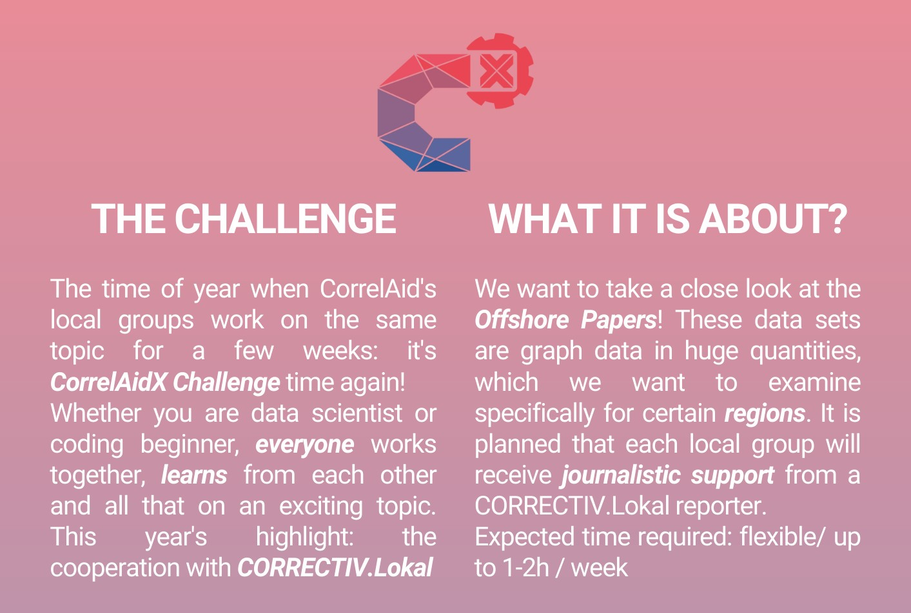
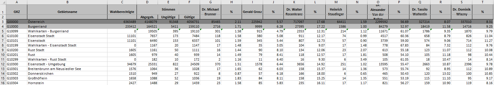

```{r xaringan-themer, include=FALSE, warning=FALSE}
library(xaringanthemer)
style_mono_accent(
  # colours
  base_color = "#ef4451", # CorrelAid grey
  background_color = "#FFFFFF",
  inverse_background_color = "#233140", 
  header_color = "#000000", # text black
  text_color = "#000000", # text black
  text_slide_number_color = "#000000",
  inverse_link_color = "#FFFFFF",
  code_inline_color ="#d95c4c", # red, but together with inverse background colour difficult to read

  
  # fonts
  header_font_google = google_font("Montserrat"),
  text_font_google   = google_font("Montserrat", "400", "400i"),
  code_font_google   = google_font("Fira Mono"),
  
  # size
  base_font_size = "20px",
  text_font_size = "1.2rem", # increased from 1rem in default
  header_h1_font_size = "1.8rem",
  header_h2_font_size = "1.5rem",
  header_h3_font_size = "1.3rem",
  footnote_font_size = "0.7rem",
  code_font_size = "0.7rem",
  
  # save colors so you can check text color inline (e.g. ".red[this text will be red]")
  colors = c(
  red = "#d95c4c",
  purple = "#ae619d",
  yellow = "#f1bc3f",
  green = "#5ba755",
  white = "#FFFFFF", 
  blue = "#0084bb",
  blue_light = "#4fb0bf",
  black = "#000000",
  grey = "#7d828c",
  green_light = "#bfce52"),
  
  # additional css inline functions 
  extra_css = list(
    
    # new centre layout function
    ".centre2" = list(
      "text-align" = "center",
      padding = "70px 0"),
    
    # left code layout function 
    ".left-code" = list(
      width = "40%",
      float = "left"),
    
    # right plot layout function
    ".right-plot" = list(
      width = "60%",
      float = "right"),
    
    # regression table layout - smaller font
    ".regression-table" = list(
      "font-size" = "1rem"),
    
    # background colour green for question box
    ".question-box" = list(
      "background-color" = "#CDE4CC",
      "text_color" = "#FFFFFF",
      "padding" = "10px 35px"),
    
    ".large" = list(
      "font-size" = "150%")
    )
)

```

```{r setup, include=FALSE}
# load packages
library(tidyverse)
library(gghalves)
library(ggdist)

# set knitr outputs for plots
knitr::opts_chunk$set(echo = TRUE, 
                      fig.align="center", 
                      dpi = 300, 
                      out.width = "85%")

# use xaringangextra features
xaringanExtra::use_panelset()

xaringanExtra::use_scribble()

xaringanExtra::use_freezeframe()

# data
data <- readRDS("../data/data_BP_election.rds")
```

class: inverse, middle
background-image: url("figures/logos/correl_aus.png")
background-position: 90% 85%
background-size: 300px

class: title-slide middle 
### `r rmarkdown::metadata$course`
#  `r rmarkdown::metadata$title`
#### `r rmarkdown::metadata$author`
#### `r rmarkdown::metadata$date`
---
class:inverse
# CorrelAidX Challenge
.pull-left[
```{r, echo=FALSE, out.width="110%"}

```
]
.pull-right[
```{r, echo=FALSE, out.width="110%"}

```
]

.centre[
Interested? 
Contact us austria@correlaid.org or 
join the CorrelAid Austria Slack channel https://docs.correlaid.org/wiki/communication/slack 
]
---
class:inverse
# About me

.pull-left[
```{r, echo=FALSE, out.width="75%",out.extra='angle=c(90)'}

```
]

.pull-right[
* lives in Neumarkt & Vienna

* studied political science & social policy

* works at the European Centre for Social Welfare Policy and Research

* mostly microsimulation of tax-benefit reforms

* has to use STATA - hates it!
]
---


```{r ggplot2 raincloud plot, echo=FALSE, fig.dim=c(9, 4.5), out.width = "100%"}
data %>% 
  filter(sprengl == TRUE) %>%
  filter(str_detect(candidate, "Bellen")) %>% 
  ggplot(aes(y = result_pct, 
             x = bland, 
             fill = bland)) +
  gghalves::geom_half_point_panel(
    aes(color = wahlkarte),
    ## draw jitter on the left
    side = "l", 
    ## control range of jitter
    range_scale = .4, 
    ## add some transparency
    alpha = .3  
  ) +
  ggdist::stat_halfeye(
    adjust = .33, 
    width = .55, 
    color = NA, 
    position = position_nudge(x = .14)
  ) +
  geom_boxplot(
    width = .15, 
    outlier.shape = NA, fill = "white") +
  scale_y_continuous(breaks=c(0, 25, 50, 75, 100)) +
  theme_minimal() +
  labs(x = "",
       y = "votes (%)",
       title = "Austrian Presidential Election 2022",
       subtitle = "Votes for Alexander Van der Bellen by election districts (postal voting districts in turquoise)") +
  theme(legend.position = "none")
```
---
# Data for today

* official election results of the 2022 Austrian presidential election

* contains data from each election district (Sprengel), political district (Bezirk), state (Bundesland), national results

* available at: https://www.bmi.gv.at/412/Bundespraesidentenwahlen/Bundespraesidentenwahl_2022/

* BUT excel file & weirdly structured


```{r election data bmi, echo=FALSE, out.width = "100%", fig.align='center'}

```

---
# Tidy data for today

* Skript for dataset transformation: https://github.com/CorrelAid/austriaWorkshops/tree/main/raincloud > 01_data_transformation.R

* Download transformed dataset: https://github.com/CorrelAid/austriaWorkshops/tree/main/raincloud > data > data_BP_election.rds OR data_BP_election.csv

* observation/row: district - candidate - votes

* new variables
  * candidate
  * result_abs
  * result_pct
  * bland
  * bezirk
  * sprengl
  * wahlkarte

---
class: inverse

---
class: inverse

# Short exercise 

**adapt the script!**

* instead of comparing the distribution of electoral districts by federal state  
--> compare the **distribution by candidates**

* change the left side of the rainclouds from **jitter** to **barcodes**

Link to codeshare:

https://pads.c3w.at/code/#/2/code/edit/TxwZ-a7BF4Iun3EQP30Al1cg/

???
  gghalves::geom_half_point_panel(
    aes(color = wahlkarte),
    ## draw jitter on the left
    side = "l", 
    ## control range of jitter
    range_scale = 0, 
    ## add some transparency
    alpha = .3,
    shape = 95,
    size = 5
  )

